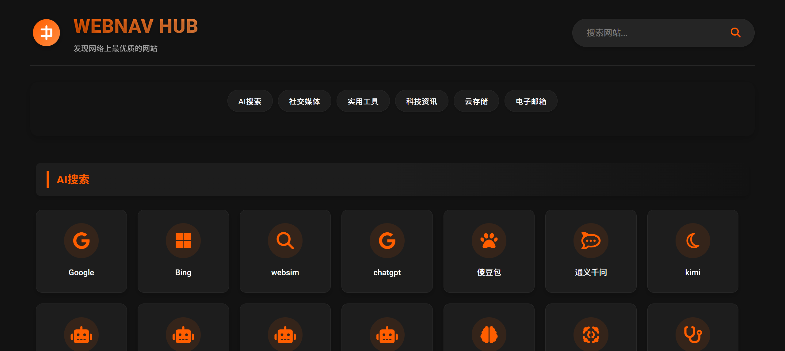

# WebNav Hub 网址导航

一个现代化的网址导航网站，提供优质网站分类展示和快速搜索功能。

## 项目简介

WebNav Hub 是一个精心设计的网址导航平台，旨在帮助用户快速发现和访问优质网站。项目采用现代化的UI设计，提供流畅的用户体验和直观的操作界面。

## 功能特点

- 🎯 **分类导航**：提供AI搜索、社交媒体、实用工具、科技资讯、云存储、电子邮箱等多个分类
- 🔍 **实时搜索**：支持网站名称和URL的快速搜索功能
- 🌓 **深色模式**：内置主题切换功能，支持浅色/深色模式
- 📱 **响应式设计**：完美适配各种设备屏幕尺寸
- ⚡ **性能优化**：采用高效的代码结构和资源加载策略
- 🎨 **现代化界面**：采用优雅的渐变色、动画效果和卡片式布局

## 技术实现

- 前端框架：原生JavaScript
- 样式处理：CSS3（支持现代浅色/深色主题）
- 图标支持：Font Awesome 6.4.0
- 字体：Google Fonts - Roboto
- 设计理念：采用直观的卡片式布局和流畅的动画效果

## 界面预览



- 响应式布局，自适应各种设备屏幕
- 优雅的渐变色主题和阴影效果
- 流畅的动画过渡和交互反馈
- 清晰的分类展示和搜索功能

## 项目来源

本项目基于 [bbylw/p](https://github.com/bbylw/p) 开发，并通过 Claude 3.7 Sonnet 大模型进行了全面的视觉升级，主要改进包括：

- 优化界面设计和用户体验
- 改进响应式布局适配
- 增强视觉效果和动画交互
- 完善主题切换功能

## 使用说明

1. 直接打开index.html即可使用
2. 点击顶部分类标签可快速定位到对应分类
3. 使用搜索框可以快速查找需要的网站
4. 点击右下角主题切换按钮可以切换深色/浅色模式

## 部署指南

### GitHub Pages 部署

1. Fork 本仓库
2. 进入仓库设置 > Pages
3. 选择 main 分支作为源
4. 您的站点将在 https://[用户名].github.io/[仓库名] 可用

### Cloudflare Pages 部署

1. 将您的 GitHub 仓库连接到 Cloudflare Pages
2. 设置构建选项：
   - 构建命令：N/A（静态站点）
   - 构建输出目录：/
3. 部署并通过 Cloudflare 提供的 URL 访问

## 项目结构与自定义指南

### 目录结构

```
.
├── index.html      # 主页面HTML文件
├── styles.css      # 样式表文件
├── script.js       # JavaScript脚本文件
├── demo.png        # 界面预览图
└── README.md       # 项目说明文档
```

### 文件说明

- `index.html`: 包含网站的基本结构和网站分类数据
- `styles.css`: 定义网站的样式，包括主题切换、响应式布局等
- `script.js`: 实现搜索、分类跳转、主题切换等功能

### 自定义修改指南

#### 添加新的网站分类

1. 在`index.html`中找到`<main>`标签内的内容
2. 参考现有分类格式，添加新的分类区块：

```html
<section class="category" id="新分类ID">
    <h2>新分类名称</h2>
    <div class="site-grid">
        <!-- 在这里添加网站卡片 -->
    </div>
</section>
```

3. 在顶部导航栏添加对应的分类链接：

```html
<a href="#新分类ID" class="nav-link">新分类名称</a>
```

#### 添加或删除网站链接

1. 在对应分类的`<div class="site-grid">`中添加或删除网站卡片：

```html
<a href="https://example.com" class="site-card" target="_blank">
    <i class="fa-solid fa-icon"></i>
    <h3>网站名称</h3>
    <p>网站描述</p>
</a>
```

2. 图标可以从 [Font Awesome](https://fontawesome.com/icons) 选择合适的图标类名

#### 自定义样式

1. 主题颜色：修改`styles.css`中的CSS变量
```css
:root {
    --primary-color: #ff5e00;
    --gradient-start: #ff5e00;
    --gradient-end: #ff8c40;
}
```

2. 卡片样式：修改`.site-card`相关的CSS规则
3. 响应式布局：调整媒体查询中的断点和样式

### 开发建议

1. 保持分类ID的唯一性
2. 确保添加的链接使用HTTPS协议
3. 为每个网站提供简明的描述
4. 测试深色模式下的显示效果

## 贡献指南

欢迎提交Issue和Pull Request来帮助改进项目。